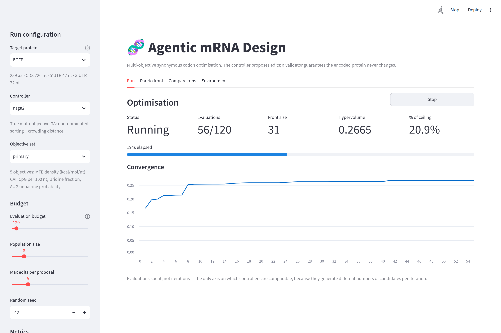
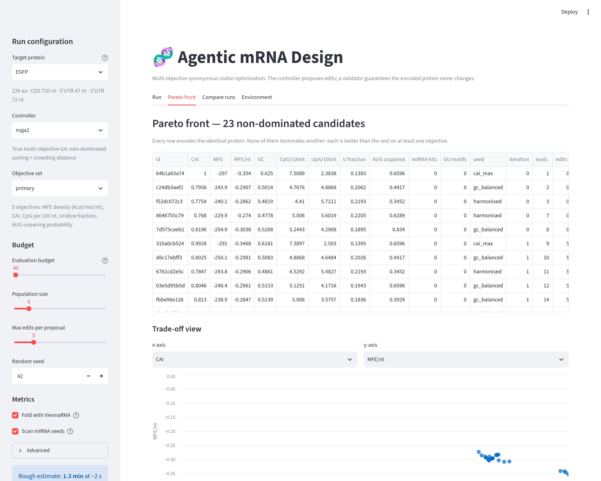

# Agentic mRNA Design Pipeline

> **Research question:** Does an LLM controller that reads region-level diagnostics and
> proposes targeted synonymous edits reach a better Pareto front than non-LLM optimisers
> **under the same evaluation budget**?

A multi-objective mRNA coding-sequence optimiser built around one hard guarantee: the
controller never writes nucleotides. It emits *edit operations* chosen from a synonymous
codon menu, and a deterministic validator decides whether each one is allowed. The encoded
protein cannot change, no matter what the controller proposes.

---

## What the pipeline does

1. **Seed** a population of candidate CDSs from a protein sequence (CAI-max, GC-balanced,
   codon-harmonised, and optionally LinearDesign).
2. **Score** each candidate on stability, translation, immunogenicity and off-target safety.
3. **Diagnose** — turn raw metric output into structured, region-level `RegionDiagnostic`
   records ("CpG hotspot at nt 340-440, severity MEDIUM").
4. **Refine** — a pluggable controller reads the diagnostics and proposes synonymous codon
   edits. Rule-based, GA, NSGA-II, CAI-max, random and LLM controllers all implement the
   same interface.
5. **Validate** — the codon applicator checks every edit (synonymy, premature stops, GC
   bounds, restriction sites) and rejects the ones that fail.
6. **Archive** — non-dominated candidates enter a Pareto archive whose hypervolume is
   tracked against evaluation budget spent.

---

## Measurement design

The headline metric is hypervolume, so three things are pinned down explicitly. All of them
live in [`mrna_design/metrics/objective_spec.py`](mrna_design/metrics/objective_spec.py).

**Objectives are normalised to [0, 1]**, oriented so 0 is best and 1 is worst, against
documented bounds. Without this, hypervolume is dominated by whichever objective has the
widest numeric range — for raw MFE (hundreds of kcal/mol) against CAI (a fraction), that is
MFE by roughly 95% to 0.08%.

**Length-extensive metrics become densities.** MFE is used as kcal/mol per nucleotide and
motif counts as rates per kilobase, so a 717 nt EGFP construct and a 1995 nt luciferase
construct are on the same scale.

**The reference point is fixed** at `1 + REF_EPS` in every dimension, not derived from the
values a given run happened to see. Hypervolume is therefore an absolute quantity in
`[0, (1+REF_EPS)^m]`, comparable across iterations, seeds, controllers and targets, and
reportable as a percentage of the achievable ceiling.

**The objective set is a named, explicit choice.** Dominance loses discriminating power as
dimensionality grows, so `primary` (5 objectives) is the default; `safety_extended` (7) and
`extended` (9) exist for ablation. The set used is written into every run manifest, and any
objective that stays constant across a run is reported as degenerate — it added a dimension
without adding information.

---

## The evaluation budget

A full objective evaluation — `compute_all()`, which folds the sequence and computes every
metric — is the expensive resource and the unit of fairness. `--max-evals` caps it, and every
controller in a benchmark gets the same cap.

Two consequences worth knowing:

- **Repeat evaluations are cached, not charged.** Re-scoring a sequence that has already been
  scored cannot produce new information. The cache hit rate is reported, so the saving is
  auditable rather than invisible. Deterministic controllers reveal themselves here: on EGFP
  the rule-based controller makes ~900 accepted edits but produces only 17 distinct
  sequences, a 91% cache hit rate.
- **Empty proposals are handled by the loop, identically for every controller**
  (`--empty-policy`). No controller carries a private fallback that quietly buys it extra
  exploration.

---

## Quick start

```bash
# 1. Environment
python -m venv .venv && source .venv/bin/activate
make install-ui          # core + dev + surrogate + the web UI

# 2. Optional databases (miRBase, GENCODE, makeblastdb).
#    Without them the miRNA and BLAST objectives are constant — the pipeline
#    warns about this at startup rather than failing.
make db

# 3. One optimisation run
mrna-design optimize \
  --protein-name EGFP \
  --controller rule_based \
  --max-evals 500 \
  --objective-set primary \
  --out results/egfp_test/

# 4. Full benchmark with statistics and plots
make bench-full
```

### The web UI

```bash
make ui            # or: streamlit run ui/app.py
```

Opens at <http://localhost:8501>.



Four tabs:

| Tab | What it does |
|---|---|
| **Run** | Pick a target, controller, objective set and evaluation budget; launch; watch hypervolume climb against budget spent, with a working Stop button |
| **Pareto front** | The trade-off menu as a sortable table and a scatter plot of any two objectives; inspect a candidate's sequence and its full edit lineage; export FASTA or CSV |
| **Compare runs** | Every run that has written a manifest, with a warning if they span different objective sets or were made without ViennaRNA |
| **Environment** | Which optional tools and databases are present, and exactly what each missing one silently costs you |



The optimisation runs on a worker thread, so the page stays responsive during a
run that takes minutes. Cancelling keeps the partial front rather than throwing
it away.

Every run directory contains:

| File | Contents |
|---|---|
| `archive.jsonl` | Final Pareto front: sequences, scores, normalised objective vectors |
| `hv_history.json` | Hypervolume against both iteration and evaluations spent |
| `manifest.json` | Config, objective set, budget, cache stats, git SHA, package versions, tool availability |
| `logs/events.jsonl` | Structured JSON event log of every tool call, proposal and edit |

---

## Project structure

```
mrna_design/
├── models/         Pydantic data models (Candidate, ObjectiveScores, CodonEdit, RegionDiagnostic)
├── validators/     Codon table, protein-identity guard, GC/stop/restriction validators
├── metrics/        CAI, ViennaRNA structure, immunogenicity, safety (miRNA/BLAST),
│                   aggregator, objective_spec (normalisation + objective sets)
├── designer/       Seeding strategies and the working population
├── controller/     BaseController, RuleBasedController, LLMController, ParetoArchive
├── baselines/      CAI-max, random, single-objective GA, NSGA-II
├── surrogate/      Feature extraction, RF/GB surrogate, optional RNA-FM embeddings
├── eval/           Statistics (Holm-Bonferroni, Vargha-Delaney A12, bootstrap CIs) and plots
├── budget.py       Evaluation budget accounting and the score cache
├── provenance.py   Run manifest: git SHA, package versions, external tool availability
├── controllers.py  Controller registry shared by the CLI and the UI
├── optimize.py     Main optimisation loop
└── cli.py          Click CLI entry points
ui/
├── app.py          Streamlit interface (make ui)
└── runner.py       Threaded run management, cancellation, result export
data/
├── codon_tables/   Human codon usage frequencies
└── targets/        Benchmark proteins (EGFP, FLuc, EPO)
scripts/            setup_databases.sh — downloads miRBase + GENCODE, builds BLAST DBs
tests/              pytest suite, including regression tests for previously-fixed defects
notebooks/          Exploratory notebooks
results/            Benchmark outputs (gitignored)
```

---

## Controllers and baselines

| Controller | What it optimises | Notes |
|---|---|---|
| `rule_based` | Diagnostics, by hand-written rules | Deterministic; stagnates quickly (see cache hit rate) |
| `llm` | Diagnostics, via an LLM | Reports token usage; degrades to a no-op if the provider is unavailable |
| `nsga2` | The full normalised objective vector | Non-dominated sorting + crowding distance. **The baseline a multi-objective claim must beat.** |
| `ga` | CAI only | Single-objective. Beating it on hypervolume shows little, since it was never optimising hypervolume. |
| `cai_max` | CAI only, greedily | Simplest possible optimiser |
| `random` | Nothing | Budget-matched random synonymous substitution |

Seeding strategies (wild-type, CAI-max, GC-balanced, harmonised, LinearDesign) are separate
from controllers and set the starting population.

---

## Dependencies

- **ViennaRNA** >= 2.6 (Python bindings via pip) — without it *all* structure metrics are
  zero and any hypervolume over them is meaningless
- **BLAST+** — optional, installed separately (see `scripts/setup_databases.sh`)
- **LinearDesign**, **RNAhybrid** — optional external binaries
- Biopython, NumPy, pandas, SciPy, pymoo, scikit-learn, Pydantic v2, Click, Rich

All optional tools fail *soft*: the pipeline warns and continues. `mrna-design bench` prints
which are missing before it starts, and records availability in each run manifest.

See `pyproject.toml` for the full list.

---

## Known limitations

Stated plainly, because they bound what the results can support.

- **The surrogate has a domain-shift problem.** It is trained on OpenVaccine, which is 107 nt
  RNA fragments with SHAPE reactivity, and applied to full-length coding sequences of 700-2000
  nt. Cross-validation R² on OpenVaccine does not transfer to that regime. It is also not yet
  wired into the main scoring loop.
- **Cross-validation is not sequence-clustered.** Plain k-fold over similar constructs gives
  optimistic estimates; grouped splits would be more honest.
- **Every metric is an in-silico proxy.** No wet-lab validation. "Immunogenicity" here means
  sequence features correlated with innate immune activation, not measured immunogenicity.
- **miRNA seed scanning is exact-match**, with no accessibility or context weighting, so it
  over-calls relative to a thermodynamic method such as RNAhybrid.
- **BLAST is run with `blastn-short`** on full-length sequences, which is not what that task
  was designed for.
- **`start_codon_unpairing` uses a 40 nt local window** rather than full-sequence base-pair
  probabilities — a speed compromise that biases the estimate.

## Reproducibility

Every run writes a `manifest.json` recording the git commit and working-tree cleanliness,
package versions, which external tools were on PATH, and whether the optional databases were
present. Because those tools fail soft, "was ViennaRNA installed when this figure was made?"
is a question the output can answer.

## Citation

*(paper in preparation)*

## License

MIT
